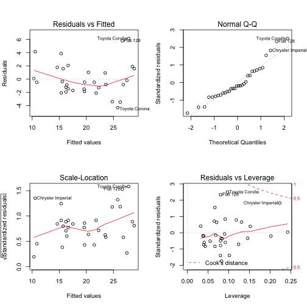

develop data product course assignment
========================================================
author: Lili Sun
date: 25 Jan, 2015

How it works?
========================================================

- Subset the mtcars dataset 
- Fit a linear regression model 
- Show model summary and plot


Design for UI
========================================================
- sider panel includes a checkboxgroupInput 
- main panel has 3 tabs: plot, summary and docs.

Some Code
========================================================


```r
dat <- mtcars[,c("mpg","cyl","wt")]
model <- lm(mpg ~ ., data = dat)
summary(model)
```

```

Call:
lm(formula = mpg ~ ., data = dat)

Residuals:
    Min      1Q  Median      3Q     Max 
-4.2893 -1.5512 -0.4684  1.5743  6.1004 

Coefficients:
            Estimate Std. Error t value Pr(>|t|)    
(Intercept)  39.6863     1.7150  23.141  < 2e-16 ***
cyl          -1.5078     0.4147  -3.636 0.001064 ** 
wt           -3.1910     0.7569  -4.216 0.000222 ***
---
Signif. codes:  0 '***' 0.001 '**' 0.01 '*' 0.05 '.' 0.1 ' ' 1

Residual standard error: 2.568 on 29 degrees of freedom
Multiple R-squared:  0.8302,	Adjusted R-squared:  0.8185 
F-statistic: 70.91 on 2 and 29 DF,  p-value: 6.809e-12
```

Some Plot
========================================================

 
